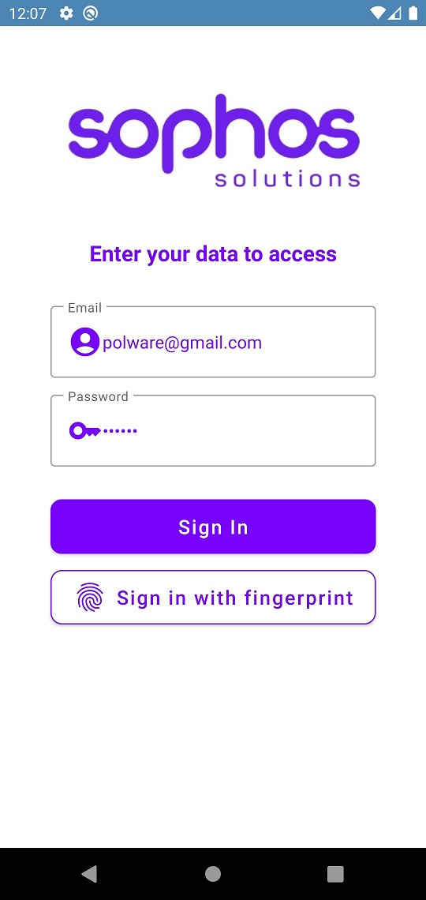
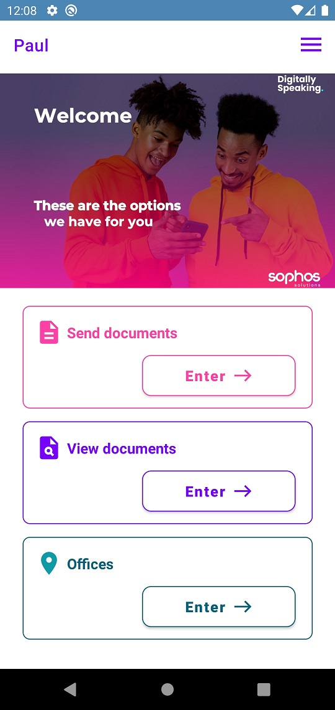
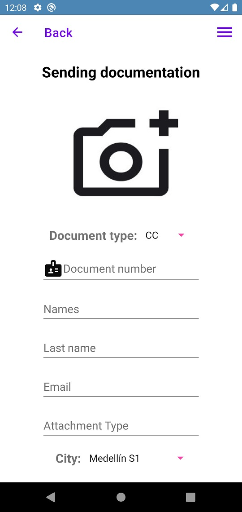
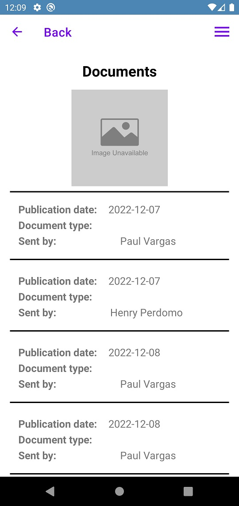
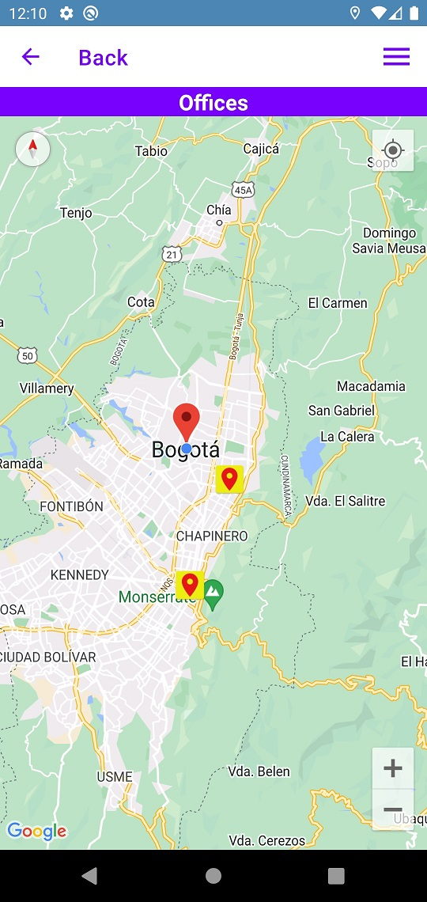
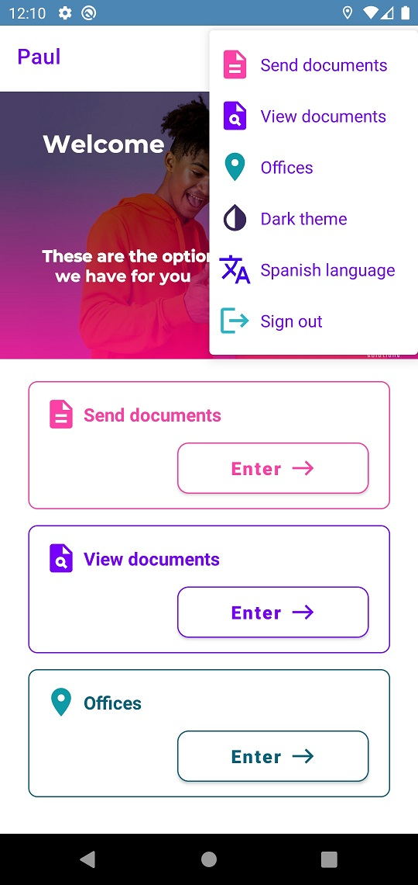

# Bootcamp Mobile Sophos
Repository containing the development of the Challenge (Sophos Solutions Application) for Bootcamp Mobile 2022.

## Architecture Used
MVVM Architecture

## Libraries
- Retrofit + Gson
- Glide
- Play services Map/Location
- KPermissions
- Biometric
- ViewModel + LiveData
- Navigation Component
- Coroutines

## Output
 ### Login page

 ### Main page

 ### Send Document page

 ### View Documents page

 ### Offices page

 ### Menu Options

